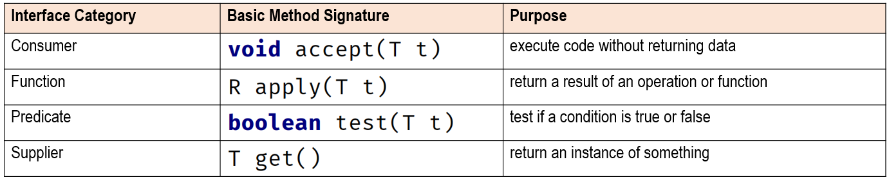
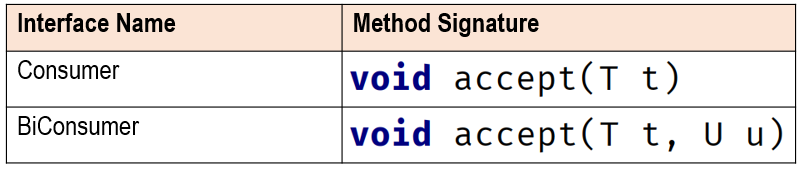
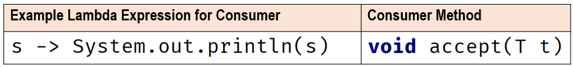
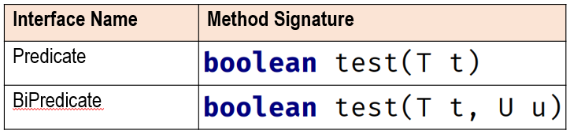
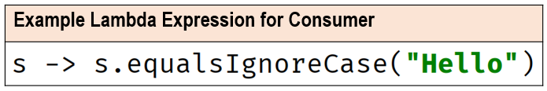
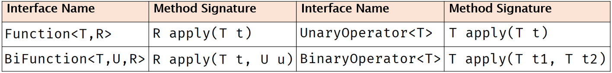
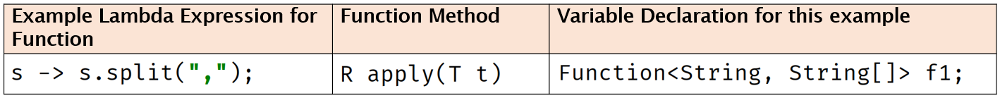
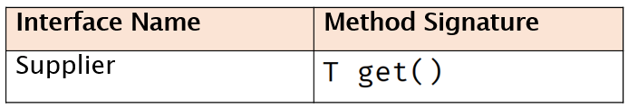
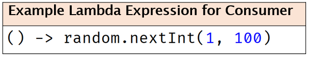

### Function Interface

#### Consumer Interface 
- 매개변수가 있고 리턴값이 없는 경우

#### Predicate Interface 
- 매개변수가 있고 리턴값이 boolean인 경우

#### Function Interface
- 매개변수가 있고 리턴값이 있는 경우

#### Supplier Interface
- 매개변수가 없고 리턴값이 있는 경우

